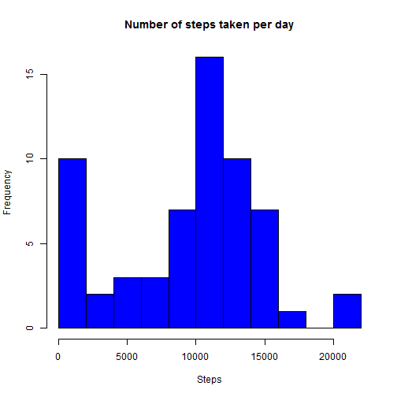
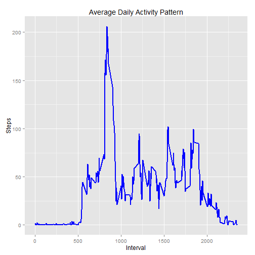
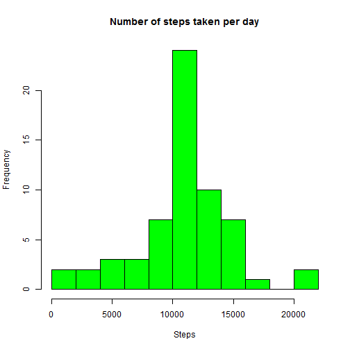
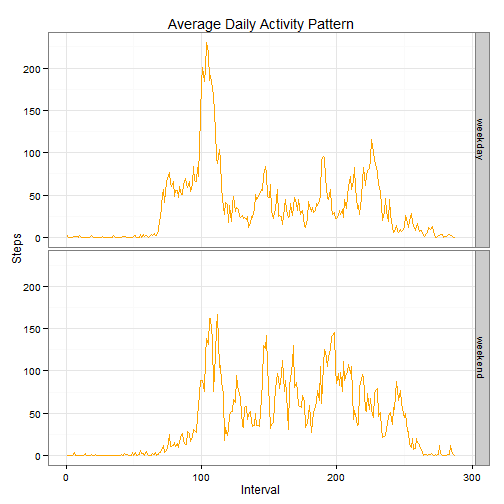

#Reproducible Research: Peer Assessment 1


##Introduction

It is now possible to collect a large amount of data about personal movement using activity monitoring devices such as a Fitbit, Nike Fuelband, or Jawbone Up. These type of devices are part of the "quantified self" movement - a group of enthusiasts who take measurements about themselves regularly to improve their health, to find patterns in their behavior, or because they are tech geeks. But these data remain under-utilized both because the raw data are hard to obtain and there is a lack of statistical methods and software for processing and interpreting the data.

This assignment makes use of data from a personal activity monitoring device. This device collects data at 5 minute intervals through out the day. The data consists of two months of data from an anonymous individual collected during the months of October and November, 2012 and include the number of steps taken in 5 minute intervals each day.


##Data

The data for this assignment can be downloaded from the [course web site](https://d396qusza40orc.cloudfront.net/repdata%2Fdata%2Factivity.zip):

Dataset: Activity monitoring data
The variables included in this dataset are:

steps: Number of steps taking in a 5-minute interval (missing values are coded as NA)

date: The date on which the measurement was taken in YYYY-MM-DD format

interval: Identifier for the 5-minute interval in which measurement was taken

The dataset is stored in a comma-separated-value (CSV) file and there are a total of 17,568 observations in this dataset.


##Loading and preprocessing the data

Assuming the .csv file is in the specified working directory, and the ggplot2 package is installed.
A brief summary of the dataset can be obtained with the str() command.


```r
library(ggplot2)
activity <- read.csv("activity.csv",header=T,colClasses=c("numeric", "character", "numeric"))
activity$date <- as.Date(activity$date, format = "%Y-%m-%d")
activity$interval <- as.factor(activity$interval)
str(activity)
```


##What is mean total number of steps taken per day?

For this step, the missing values in the dataset are ignored.


```r
daysteps <- tapply(activity$steps, activity$date, FUN=sum, na.rm=T)
hist(daysteps,main="Number of steps taken per day", xlab="Steps", col="blue",breaks=10)
```

 

Obtaining the mean and median number of steps taken per day


```r
mean(daysteps, na.rm=T)
```

```
## [1] 9354.23
```

```r
median(daysteps, na.rm=T)
```

```
## [1] 10395
```


## What is the average daily activity pattern?

Obtain the average of the number of steps taken for each 5 minute interval, and 
plotting a time series plot illustrating the data.


```r
daysteps_mean <- aggregate(x=list(steps=activity$steps), by = list(interval=activity$interval),
                           FUN=mean, na.rm=T)
daysteps_mean$interval <- as.integer(levels(daysteps_mean$interval)[daysteps_mean$interval])
ggplot(daysteps_mean, aes(x=interval, y=steps)) +   
    geom_line(color="blue", size=1) +  
    labs(title="Average Daily Activity Pattern", x="Interval", y="Steps")
```

 

Identifying the 5-minute interval with the maximum number of average steps.


```r
daysteps_mean[which.max(daysteps_mean$steps),]
```

```
##     interval    steps
## 104      835 206.1698
```


## Imputing missing values

The original dataset has a number of days/intervals with missing values.
Firstly, to find out how many observations contain missing values.


```r
miss <- is.na(activity$steps)
table(miss)
```

```
## miss
## FALSE  TRUE 
## 15264  2304
```

Next, to create a function which fills up the missing steps values with the mean
of that 5-min interval.


```r
fillstep <- function(steps, int) {
    temp = 0
    if (!is.na(steps)) temp = steps
    else temp = daysteps_mean[daysteps_mean$interval == int, "steps"]
    return(temp)
}
```

Now to create a new dataset with all missing values filled up using above function.


```r
activity_fill <- activity
activity_fill$steps <- mapply(fillstep,activity_fill$steps,activity_fill$interval)
```

Plot histogram of the new dataset with no missing values, as well as obtain the mean
and median of the total number of steps taken per day.


```r
daysteps_fill <- tapply(activity_fill$steps, activity_fill$date, FUN=sum, na.rm=T)
hist(daysteps_fill, main="Number of steps taken per day", xlab="Steps",col="green",breaks=10)
```

 

```r
mean(daysteps_fill)
```

```
## [1] 10766.19
```

```r
median(daysteps_fill)
```

```
## [1] 10766.19
```

The mean and median of the filled dataset is higher than that computed in the first part of the assignment. Additionally, the median is equals the mean for the filled dataset, whereas the mean was less than the median originally. The estimate for the total daily number of steps have increased after imputing missing data.


## Are there differences in activity patterns between weekdays and weekends?

Approach taken here is to create a function to identify if the date corresponds to a weekday 
or weekend, and to apply this function to the filled dataset.


```r
weekdaytype <- function(date) {
    day <- weekdays(date)
    if (day %in% c("Monday", "Tuesday", "Wednesday", "Thursday", "Friday")) 
        return("weekday") 
    else if (day %in% c("Saturday", "Sunday")) 
        return("weekend")
    else stop("invalid date")
}
activity_fill$day <- sapply(activity_fill$date, FUN = weekdaytype)
```

Next, create a panel plot containing a time series plot of the 5-minute interval (x-axis) and the average number of steps taken, averaged across all weekday days or weekend days (y-axis).


```r
daytype_mean <- aggregate(steps ~ interval + day, data = activity_fill, mean)
ggplot(daytype_mean, aes(as.numeric(interval), steps)) +
    geom_line(col="orange") + facet_grid(day ~ .) + 
    labs(title="Average Daily Activity Pattern", x="Interval", y="Steps") +
    theme_bw()
```

 
